# PH PLUS — Workflows funcionales

> Cómo cada flujo principal del e-commerce viaja desde el click del usuario
> hasta la persistencia en Supabase, qué eventos dispara, qué emails se
> generan y dónde lo ve el admin.

---

## Índice

**Usuario final**
1. [Compra como invitado](#1-compra-como-invitado-guest-checkout)
2. [Registro + primera compra logueado](#2-registro--primera-compra-logueado)
3. [Recuperar contraseña](#3-recuperar-contraseña)
4. [Wishlist y favoritos](#4-wishlist-y-favoritos)
5. [Escribir una reseña](#5-escribir-una-reseña)
6. [Aplicar cupón](#6-aplicar-cupón)

**Admin**
7. [Procesar un pedido (de pendiente a entregado)](#7-procesar-un-pedido)
8. [Crear / editar un producto](#8-crear--editar-un-producto)
9. [Ajustar inventario](#9-ajustar-inventario)
10. [Moderar reseñas](#10-moderar-reseñas)
11. [Editar contenido del home](#11-editar-contenido-del-home)

**Sistema**
12. [Keep-alive (mantener Supabase activo)](#12-keep-alive-supabase)
13. [Migraciones de schema](#13-migraciones-de-schema)

---

## 1. Compra como invitado (guest checkout)

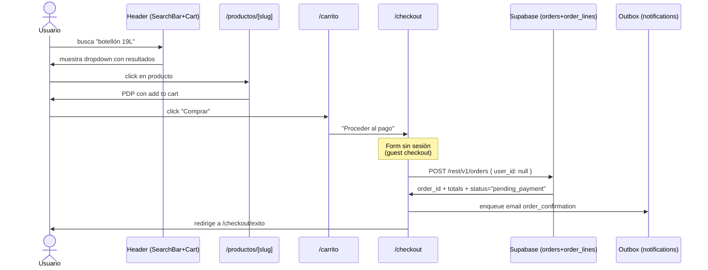

**Reglas clave**

- `user_id` es `null` → RLS permite SELECT al admin y al cliente que tenga el `order_id` (ver `orders_owner_or_guest_select`).
- El email se encola en `notifications_outbox` con status `queued`. Una edge function (futura) lo manda real vía Resend.
- En `/checkout/exito` se ofrece "crea tu cuenta con un click" usando el email del pedido como prellenado.

**Tests**
- E2E screenshot: `02-checkout/04-pedido-confirmado.png`
- Unit: `features/checkout/domain/totals.test.ts` (submitOrder)

---

## 2. Registro + primera compra logueado

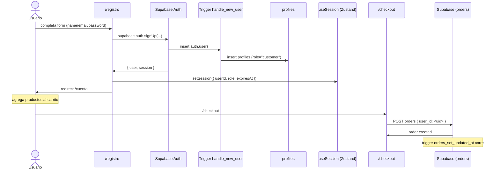

**Reglas clave**

- El trigger `handle_new_user` en `auth.users` auto-crea la profile.
- El JWT de Supabase tiene `auth.uid()` → RLS permite leer/escribir sus propios `orders`, `addresses`, `reviews`.
- Si el browser se cierra, la cookie de sesión persiste hasta `expiresAt` (7 días default).

**Archivos**
- `app/registro/page.tsx`
- `src/features/auth/service.supabase.ts:signup`
- `supabase/migrations/20260520000002_functions_and_triggers.sql:handle_new_user`

---

## 3. Recuperar contraseña

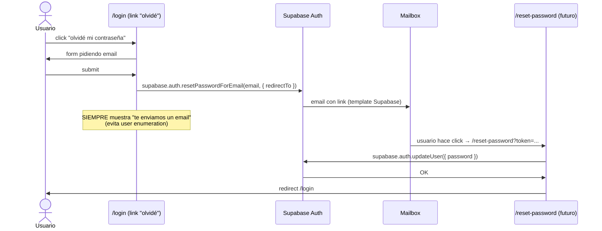

**Notas de seguridad**

- La función SIEMPRE devuelve `{ sent: true }` aunque el email no exista (evita
  que un atacante descubra emails registrados).
- El link en el email caduca en 1h (config en Supabase Auth).

---

## 4. Wishlist y favoritos

```mermaid
flowchart LR
  A[Click ♡ en ProductCard] --> B[useWishlist.toggle slug]
  B --> C{Estaba ya?}
  C -- no --> D[add con addedAt = now]
  C -- sí --> E[remove]
  D --> F[Zustand persist → localStorage]
  E --> F
  F --> G[Header badge se actualiza]
  G --> H[/cuenta/favoritos lista con ProductCard]
```

**Por qué localStorage (no Supabase)**

- Permite usar wishlist como invitado.
- El día que querramos sync server-side, hacemos un `useEffect` que sube al
  endpoint `POST /rest/v1/wishlist_items` cuando hay sesión y mergea al login.

---

## 5. Escribir una reseña

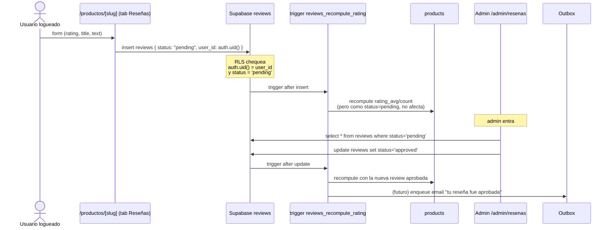

**Reglas clave**

- Sólo usuarios logueados pueden insertar (RLS).
- El status SIEMPRE arranca en `pending`; el cliente no puede setearlo a
  `approved`.
- `products.rating_average` y `rating_count` se mantienen en sync con un
  trigger — no hay que reconcilirlos manualmente.

---

## 6. Aplicar cupón

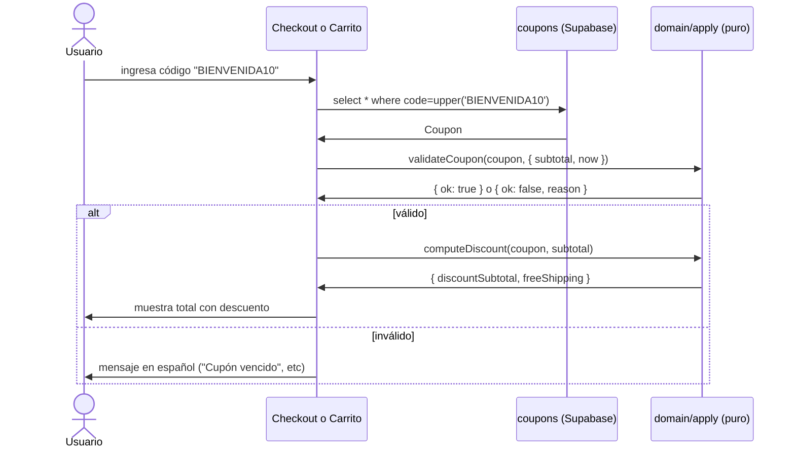

**Reasons posibles**

- `NOT_STARTED` — starts_at futuro
- `EXPIRED` — ends_at pasado
- `INACTIVE` — is_active=false
- `MIN_SUBTOTAL_NOT_REACHED` — subtotal < min_subtotal
- `MAX_USES_REACHED` — used_count >= max_uses

---

## 7. Procesar un pedido

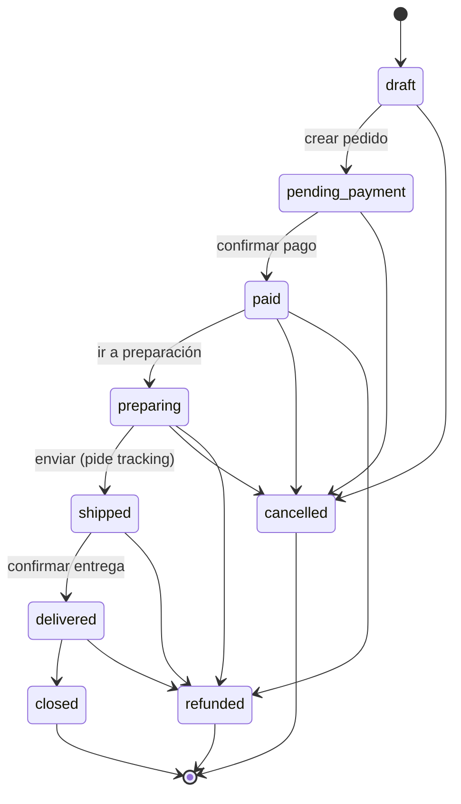

**Cómo lo hace el admin**

1. `/admin/pedidos` → ve la lista filtrable por estado / fecha / monto.
2. Click en una fila → `OrderDetail` con la línea de tiempo.
3. Click "Marcar como enviado" → modal pide tracking number.
4. Admin confirma → `update orders set status='shipped', tracking_number='...'`
5. **Trigger DB valida la transición** (`enforce_order_status_transition`).
   Si tratás de saltar de `pending_payment` a `delivered` directo, error 23514.
6. Email "tu pedido fue enviado" se encola en outbox.
7. Cliente lo ve en `/cuenta/pedidos`.

---

## 8. Crear / editar un producto

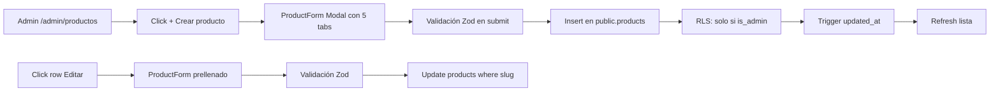

**Tabs del form**

- **General**: slug (auto-kebab), title, shortTitle, tagline, description, category, size, visualKey, isActive
- **Precio**: priceValue, prevPriceValue (validado > priceValue), popularity 0-100
- **Imágenes**: uploader a bucket `product-images` (futuro)
- **Stock**: stock current + low threshold (escribe en `stock_items`)
- **SEO**: meta_title, meta_description

---

## 9. Ajustar inventario

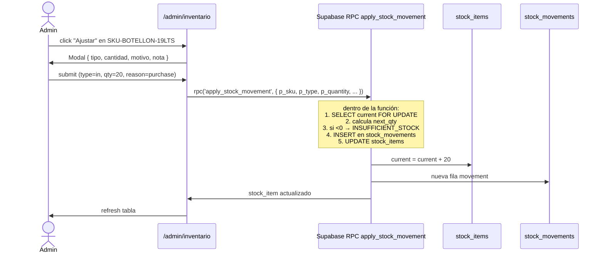

**Por qué RPC en vez de UPDATE directo**

- Atomicidad: lock row → calcular → escribir, todo en una transacción.
- Validación server-side: imposible bypassear `INSUFFICIENT_STOCK` desde el
  cliente.
- Auditoría: cada cambio queda registrado en `stock_movements`.

---

## 10. Moderar reseñas

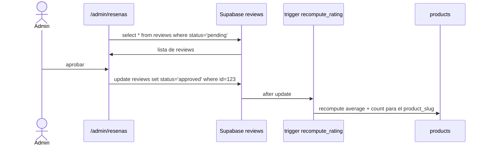

Igual para rechazar (con motivo) y responder (escribe `admin_response`).

---

## 11. Editar contenido del home

`/admin/contenido` → 4 secciones editables:

| Sección | Schema en `public.content` |
|---|---|
| Hero (title, subtitle, CTA) | `home_hero jsonb` |
| Productos destacados | `featured_slugs jsonb` (array de slugs) |
| Banners | `banners jsonb` (array) |
| FAQ | `faq jsonb` (array) |

El home (`app/page.tsx` componente `Hero`) lee de `contentRepo.get()` en el
server. Cualquier cambio en admin se refleja en el próximo render (ISR cuando
lo activemos).

---

## 12. Keep-alive Supabase

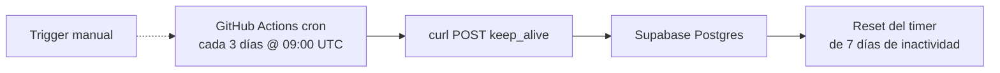

**Por qué**

- Free tier pausa proyectos a los 7 días sin actividad de DB.
- Con tráfico real >10 visits/día NO se pausa porque cada page-load lee algo.
- Pero si vienen 5 días sin tráfico (vacaciones, feriado largo), se pausa.
- El cron lo previene 100%: cuesta $0, corre solo, alertas si falla.

Configuración: `.github/workflows/supabase-keepalive.yml` + 2 secrets
(`SUPABASE_URL`, `SUPABASE_ANON_KEY`).

---

## 13. Migraciones de schema

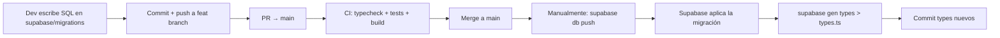

**Reglas**

- Nombre del archivo: `<YYYYMMDDHHMMSS>_<snake_case_name>.sql`.
- Siempre forward-only (no rollbacks); si se equivocó, nueva migración que
  revierte.
- Idempotente cuando se pueda (`create table if not exists`, `on conflict do
  nothing`).
- Testear localmente con `supabase db reset` antes del push remoto.

---

## Referencias cruzadas

- Schema completo: [`supabase/migrations/20260520000001_initial_schema.sql`](../supabase/migrations/20260520000001_initial_schema.sql)
- RLS por tabla: [`supabase/migrations/20260520000003_rls_policies.sql`](../supabase/migrations/20260520000003_rls_policies.sql)
- Estado de pedido (TS): [`src/features/orders/domain/status.ts`](../src/features/orders/domain/status.ts)
- Estado de pedido (SQL): [`supabase/migrations/20260520000002_functions_and_triggers.sql`](../supabase/migrations/20260520000002_functions_and_triggers.sql) → `is_valid_order_transition`
